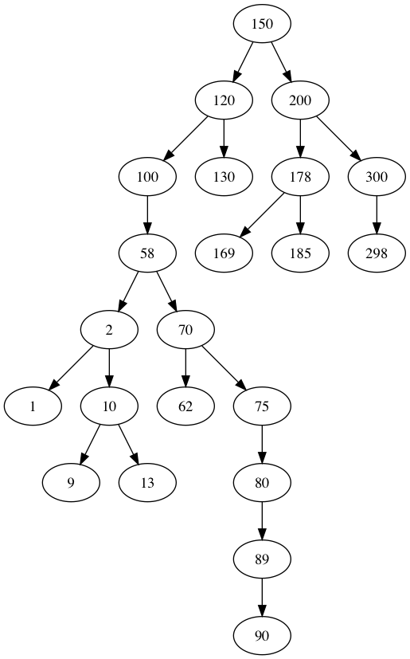

# Yet another BST creator



This is the final project for the Discrete Math subject in my school. This program is completely written in C, and uses the **AT&T's Graphviz*** library to create and render graphs into PNG images. This is really basic, I just took advantage of this project to learn a little bit of C. I could have done this in Python or even Java, but it would have been really boring: I needed a little challenge.

## Requirements

To compile and run this project you need to have:

+ PC with Windows, Darwin or GNU.
+ GCC or Clang compiler.
+ Graphviz library installed.
+ Basic knowledge about C.
+ Basic knowledge about computers.

## Compile and run

This project uses the `Fakemile.sh` bash script to compile all the source files or a specific file. As a note, Fakemile is different from Makefile. The project uses GCC as the default compiler, you can change it in the code.

```bash
sh Fakemile.sh
```

## Usage

To run the program, you need to pass the name of the output file to which the tree will be rendered. You will be asked for the value of the root node and then, a full-featured and incredible shell will be started.

```bash
./tree graph.png
Initialisation
Root value: 10
CMD:\> 
```

The available commands are `insert`, `inorder`, `preorder`, `postorder`, `render` and `exit`. Any unknown command will just be ignored. Here, you can see an example with all the commands:

```
CMD:\> insert 15
CMD:\> insert 20
CMD:\> insert 60
CMD:\> inorder
15 20 60 10 CMD:\> preorder
10 15 20 60 CMD:\> postorder
15 20 60 10 CMD:\> render
CMD:\> exit
```

## Licence

```
Copyright (C) 2019  Iván Ávalos

This program is free software: you can redistribute it and/or modify
it under the terms of the GNU General Public License as published by
the Free Software Foundation, either version 3 of the License, or
(at your option) any later version.

This program is distributed in the hope that it will be useful,
but WITHOUT ANY WARRANTY; without even the implied warranty of
MERCHANTABILITY or FITNESS FOR A PARTICULAR PURPOSE.  See the
GNU General Public License for more details.

You should have received a copy of the GNU General Public License
along with this program.  If not, see <https://www.gnu.org/licenses/>.
```
